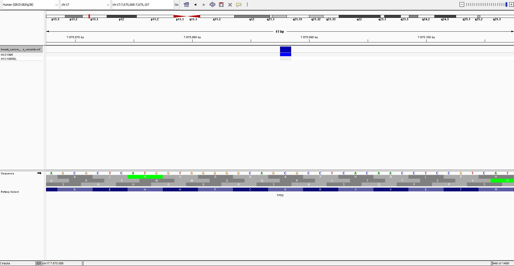
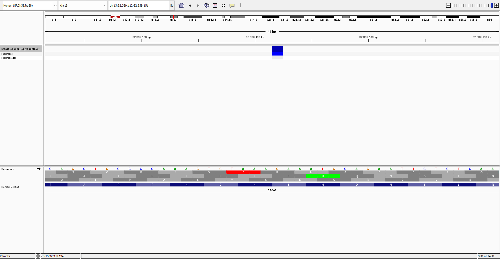

# Cancer Variant Calling & Interpretation

Somatic variant calling and clinical-style interpretation from whole-genome sequencing data of the SEQC2 reference tumor-normal pair (HCC1395/HCC1395BL), following GATK Best Practices, validated against the official SEQC2 truth set, and annotated for clinical relevance.

## Context

This project applies germline and somatic variant calling concepts from GATK Best Practices to a real, well-characterized cancer reference sample: HCC1395 (triple-negative breast cancer cell line) paired with its matched normal, HCC1395BL. The pair is the community reference standard established by the FDA-led SEQC2 consortium (Fang et al., 2021, *Nature Biotechnology*), with a publicly available high-confidence somatic variant call set used here for validation.

This project builds on [ngs-qc-alignment-pipeline](https://github.com/jaquelinebail/ngs-qc-alignment-pipeline) and [germline-variant-calling-gatk](https://github.com/jaquelinebail/germline-variant-calling-gatk), extending that work from a bacterial test dataset to full human whole-genome sequencing and somatic (tumor-normal) variant interpretation at production scale.

## Data

- **Tumor:** HCC1395 — SRA accession SRR7890824
- **Normal:** HCC1395BL — SRA accession SRR7890827
- **Reference:** GRCh38 (Broad Institute resource bundle)
- Whole-genome sequencing, Illumina paired-end

## Cloud infrastructure

To handle full whole-genome alignment and variant calling at production scale, the pipeline — BWA-MEM alignment, duplicate marking, base quality score recalibration (BQSR), and somatic variant calling (Mutect2) — was deliberately executed on AWS (EC2, m5.4xlarge: 16 vCPUs / 64GB RAM) rather than scaled down to fit local hardware. This mirrors how genomic pipelines are run in practice: compute is provisioned to match the workload, not the other way around. Final outputs (filtered VCF, QC and validation metrics) were retrieved to local storage for downstream analysis and version control; intermediate BAM files were intentionally not retained, keeping cloud storage costs minimal once processing was complete.

## Pipeline

```
FASTQ (SRA) → BWA-MEM alignment → MarkDuplicates → BQSR (Analysis-Ready BAM)
→ Mutect2 (tumor-normal) → LearnReadOrientationModel → Contamination estimation
→ FilterMutectCalls → Progressive quality filtering → Truth set validation
→ VEP annotation → ACMG-style classification
```


Somatic calling used a Panel of Normals (1000 Genomes) and population allele frequencies (gnomAD) to distinguish somatic from germline variants: PoN and population frequency inform Mutect2's germline/somatic weighting, cross-sample contamination is estimated from population-informative sites, and F1R2 read orientation counts correct for strand bias artifacts before final filtering.

## Results: progressive filtering

Raw Mutect2 output required additional interpretation beyond the default PASS filter. Each additional filter was chosen based on a specific, documented rationale rather than applied arbitrarily:

| Step | Variants | Rationale |
|---|---|---|
| Mutect2 raw calls | 271,829 | All candidate SNVs and indels |
| PASS (Mutect2 default filters) | 98,300 | Removes clustered events, strand bias, normal artifacts, weak evidence, etc. (173,529 removed by Mutect2's own filtering) |
| + AD ≥ 10 (alt allele) | 87,883 | Minimum read support required to consider a variant reliably called, per standard somatic calling practice |
| + GERMQ ≥ 20 | 76,579 | Minimum confidence that a variant is somatic rather than germline |
| + POPAF ≥ 4 (≈ <0.01% population frequency) | **35,553** | Excludes variants with population frequency inconsistent with a true somatic (non-inherited) origin |

The largest single reduction came from the population frequency filter, indicating that residual germline signal — not sequencing artifact — was the primary driver of the initial high variant count. This is consistent with the normal sample's coverage (~45x) falling below the commonly recommended ≥100x threshold for confidently distinguishing somatic from germline variants in heterogeneous tumor samples, and informed the filtering strategy applied.

## Validation against the SEQC2 truth set

Final filtered variants (SNVs and indels evaluated separately) were compared against the official SEQC2 high-confidence somatic call set (v1.2) using `bcftools isec`.

| Metric | SNVs | Indels |
|---|---|---|
| True positives | 27,692 | 1,288 |
| False positives | 4,624 | 1,267 |
| False negatives | 11,868 | 634 |
| **Precision** | **85.7%** | 50.4% |
| **Recall (sensitivity)** | **70.0%** | 67.0% |
| **F1-score** | **77.1%** | 57.5% |

These results are consistent with expectations for a single-caller (Mutect2-only) pipeline evaluated against an ensemble-based truth set. The SEQC2 reference call set was built from 6 variant callers, 3 aligners, 20+ WGS replicates across multiple sequencing centers, and machine learning consensus refinement (SomaticSeq, NeuSomatic) — a single-tool pipeline is expected to report more candidates than this heavily cross-validated consensus, and indel calling is a known harder problem than SNV calling for any single caller.

## Annotation and clinical interpretation

The 35,553 filtered, truth-set-validated variants were narrowed to coding-consequence variants within five well-established breast cancer genes (*TP53, BRCA1, BRCA2, PIK3CA, PTEN*), reflecting HCC1395's known tumor type. Annotation was performed with Ensembl VEP, including AlphaMissense, REVEL, ClinPred, CADD, SpliceAI, and gnomAD population frequencies.

### TP53 p.Arg175His (R175H) — chr17:7,675,088 C>T

One of the most extensively characterized hotspot mutations in cancer genomics, located in the TP53 DNA-binding domain.

| Evidence | Value |
|---|---|
| Consequence | Missense |
| AlphaMissense | 0.9857 (likely pathogenic) |
| REVEL | 0.922 |
| ClinPred | 0.9929 |
| CADD (PHRED) | 25.9 |
| gnomAD frequency | ~4×10⁻⁶ – 6.6×10⁻⁶ |
| Tumor VAF | 97.8% |
| GERMQ | 93 |

**ACMG-style classification: Pathogenic / Likely Pathogenic** (PM1 — mutational hotspot; PM2 — absent/extremely rare in population databases; PP3 — multiple concordant in silico predictions).

### BRCA2 p.Glu1593Ter (E1593*) — chr13:32,339,132 G>T

A nonsense variant introducing a premature stop codon in BRCA2, a well-established tumor suppressor gene.

| Evidence | Value |
|---|---|
| Consequence | Stop-gained (loss of function) |
| CADD (PHRED) | 36 |
| Population frequency (POPAF) | ~6 (≈0.0001%) |
| Tumor VAF | 48.9% |

**ACMG-style classification: Pathogenic** (PVS1 — very strong evidence for predicted loss-of-function variants in a gene where loss of function is a known disease mechanism; PM2 — absent/extremely rare in population databases).

### IGV visualization




Genotype tracks confirm the variant call pattern expected of a true somatic event: present in the tumor sample (HCC1395), absent/negligible in the matched normal (HCC1395BL).

## Notes for future iterations

- A Panel of Normals matched to this dataset's specific sequencing platform would likely further improve precision over the generic 1000 Genomes-based PoN used here.
- Scaling this pipeline further (e.g., scatter-gather parallelization across genomic intervals) would reduce wall-clock time for multi-sample cohorts.
- Combining Mutect2 with additional callers (ensemble approach) would be the natural next step to approach the precision/recall achieved by the SEQC2 reference pipeline itself.

## Technologies

GATK4 (BWA-MEM, MarkDuplicates, BaseRecalibrator, Mutect2, FilterMutectCalls), samtools, bcftools, SRA Toolkit, AWS EC2, Ensembl VEP, tmux.

## How to reproduce

Full commands and rationale for each pipeline step are documented in this repository's commit history and accompanying scripts. Reference files (GRCh38, known sites, Panel of Normals, gnomAD, SEQC2 truth set) are publicly available from the Broad Institute GATK resource bundle and the SEQC2 consortium (NCBI).
